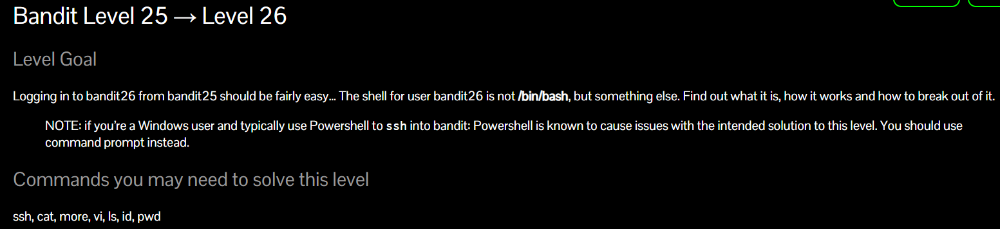
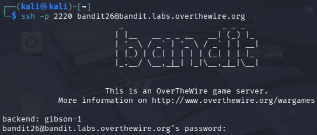
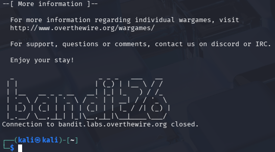
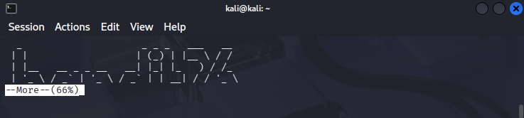
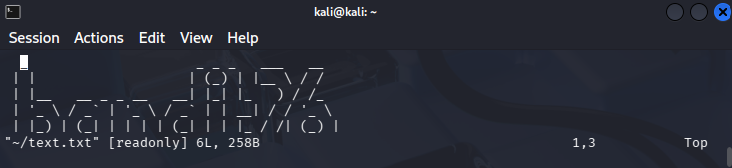
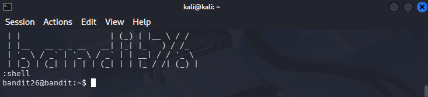
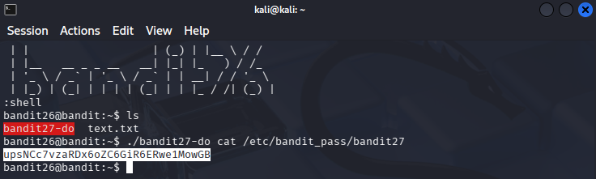

## Write-Up: Bandit Level 25 -> 26
**Platform:** OverTheWire (Bandit) / Machine or virtual machine with a Linux OS
**Goal:** Breaking out of a restricted shell (`more` => `vim`).
### Overview

At this level, the user “bandit26” has a custom restricted shell. Instead of a standard Bash prompt, the system runs a script that displays a text file and logs the user out. You must find a way to bypass the logout and find the key to the next level.
### The Goal
The user's shell was set to “/usr/bin/showtext,” which runs “more” on a file. SSH attempts would display the text and terminate the connection, preventing commands from being entered.

###  Solution
#### 1. Trying to connect to the Bandit26 terminal
With the password obtained in the previous level, we log in via SSH to bandit26: `ssh bandit26@bandit.labs.overthewire.org -p 2220`

`more` is a shell command that allows you to display files interactively. This interactive mode only works when the file content is too large to be displayed completely in the terminal window. One command that is allowed in interactive mode is `v`. This command will open the file in the `vim` editor. Therefore, to cause a pause, minimize the size of the terminal window (5-8 lines) after entering the password Bandit26.

#### 2. Escaping to Vim
Once the message “--More--” appeared, the session was “paused.” Since ‘more’ allows you to open the current file in an editor, I pressed `v` to start **Vim**. Vim is a text editor. It also allows you to execute shell commands. So we will use it to exit a restricted environment and generate a shell.

#### 3. Breaking out to Bash
You can now expand the window. Each user has a default shell. This is important when using ssh, as this is the shell that will be displayed (the default shell per user is located at the end of the user line in the ‘/etc/passwd’ file).
Within Vim, I was still under the “bandit26” user context. I used Vim's command mode to reconfigure the default shell and activate it (Important to start with `:`):
1. Set the shell variable: “:set shell=/bin/bash” ...*(Press Enter)*
2. Invoke the shell: “:shell” ...*(Press Enter)*

#### 4. Privilege Escalation (SUID)
Once in the shell, I found a SUID binary `bandit27-do`. I used it to read the password for the next level: `./bandit27-do cat /etc/bandit_pass/bandit27`. With this, we can open the password file and read it.

The password that appears will be used for the next level (26->27).
### Key Takeaway
These types of challenges teach us to think outside the box. By understanding how common binaries such as “more” and ‘vim’ interact with the system, an attacker can escape restricted environments (“jailbreaking”) without the need for exploits or more invasive tools.
