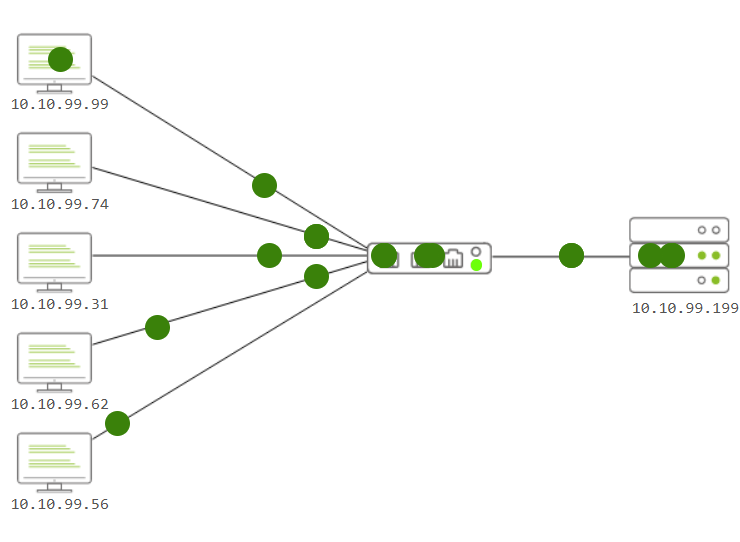
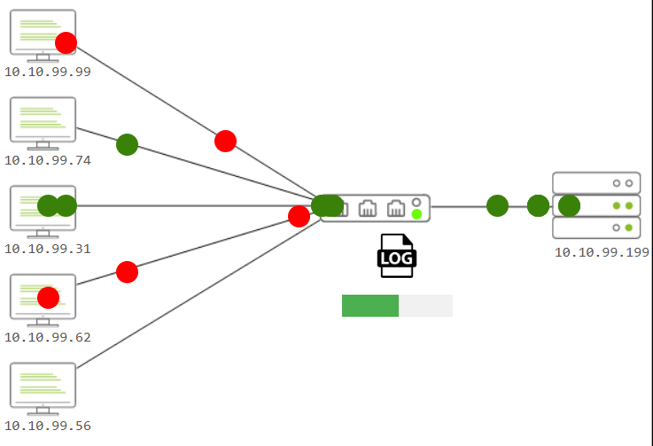
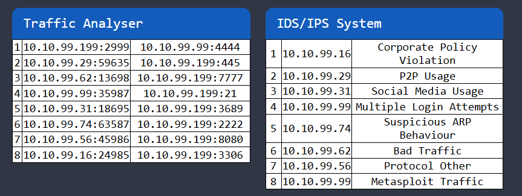

# Network Traffic Analysis: Write-Up (Traffic Analysis-THM)

> [!summary] Summary
> Solution to a TryHackMe lab (basic level) that analyzes packet traffic across a basic network, identifying hosts sending suspicious packets and suspicious ports.

## 1. Metadata & Scope

- **File Analyzed:** `mock website in the "TryHackMe" room`
- **Tools Used:** `Intrusion Detection and Prevention System, simulated by THM `

---

## 2. Technical Analysis & Findings

### Initial Discovery
This lab shows us the logical map of a basic network and simulates traffic from multiple hosts to a server. Some of these packets are malicious and can compromise the server.

First, the packet traffic to the server must be logged by the intermediate device. From this point on, you can already see the bad packets, but you still need to analyze why they are bad.

### Traffic Flow & Investigation
- **Source IP / Suspects:** `[10.10.99.99] & [10.10.99.62]`
- **Destination IP / Target:** `[10.10.99.199]`

The IDS/IPS system shows that the host with IP address 10.10.99.99 is making multiple attempts to access the system and/or trying to use Metasploit. Additionally, the host with IP address 10.10.99.62 is generating a high volume of traffic.
Referring to the same table, three suspicious ports are visible: 2222, 4444, and 7777.
### The Incident / Attack Payload
IP 10.10.99.99 : Since this host is attempting to gain access using Metasploit, they could potentially breach the system and compromise it.
IP 10.10.99.62: It's generating a lot of traffic, which can reduce performance and QoS.

For suspicious ports: 2222, 4444, and 7777.
These are considered suspicious because most are configured by default in hacking tactics; detecting suspicious traffic on these ports may indicate an attack. Another reason could be the attacker’s convenience—it’s easier to remember a pattern than a random port number.
It is also possible that some services use alternative ports, either by choice of the administrator (e.g., SSH on port 2222 instead of 22) to avoid automated scans, etc.

> [!example] Evidence
> **Frame [6]:** [Bad Traffic]
> *This generally refers to misshapen packages or large quantities of items with no apparent purpose.*
> **Frame [8]:** [Metasploit Traffic]
> *Metasploit is an exploitation framework, which means that someone is attempting to—or has succeeded in—exploiting a known vulnerability to gain full control of the computer.*
> ---The rest consists of evidence that can wait to be analyzed in depth; frames 6 and 8 require the utmost attention.---

---

## 3. Indicators of Compromise (IoCs)

| Type             | Value                           | Description                    |
| :--------------- | :------------------------------ | :----------------------------- |
| **Attacker IP**  | `[10.10.99.99] & [10.10.99.62]` | They send malicious traffic    |
| **Target IP**    | `[10.10.99.199]`                | Server they want to compromise |
| Suspicious ports | `[2222], [4444] & [7777]`       | Attack vector                  |

---

## 4. Conclusion
Using an Intrusion Detection and Prevention System (IDS/IPS) made it easier to identify anomalies (potential attacks) in the packets being sent to the target server. The network administrator simply needs to review the logs, filter out malicious IP addresses, and block the ports that could be used to compromise the server in this case.
## 5. Recommendations / Remediation (Optional)
- In the event of “Multiple Login Attempts,” a password reset must be enforced for all accounts associated with that host.
- If the system is in detection mode only, preventive measures should be implemented to automatically block known signatures, such as those from Metasploit.
- Also use SIEM (Security Information and Event Management) to check whether the IP address 10.10.99.99 attempted to compromise other devices before being detected, and perform a regular scan to patch the vulnerabilities that Metasploit attempted to exploit.
